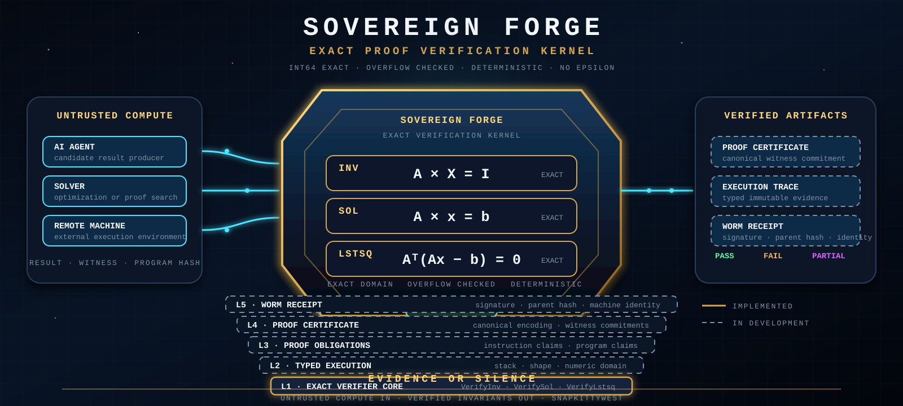

# Sovereign Forge

<p align="center">
  
</p>

<p align="center">
  <strong>Exact, deterministic verification for linear-algebra witnesses.</strong>
</p>

<p align="center">
  <strong>Compute anywhere. Verify independently.</strong>
</p>

---

[](https://www.open-std.org/jtc1/sc22/wg14/)
[](tests/)
[](proofs/lean4/)
[](LICENSE)

---

## Overview

Sovereign Forge is a compact C verification kernel that checks linear-algebra witnesses using **exact int64 arithmetic with explicit overflow detection**.

It does not trust the solver that produced the answer. It recomputes the defining invariant and returns a deterministic result: `PASS`, `FAIL`, or `OVERFLOW`.

## Verified Obligations

| Operation | Invariant |
|-----------|-----------|
| Matrix inverse | A × X = I |
| Linear solution | A × x = b |
| Least squares | Aᵀ(Ax − b) = 0 |

## Guarantees

- **Exact integer equality** — No floating-point tolerance
- **Checked arithmetic** — Multiplication, addition, subtraction all overflow-detected
- **Deterministic** — Same input always produces same output
- **Small audit surface** — ~2,000 lines of core verifier

## Build

```bash
git clone https://github.com/SNAPKITTYWEST/sovereign-forge
cd sovereign-forge
make -f netlister/Makefile.sov
make -f netlister/Makefile.sov test
# Output: 77+ tests PASS
```

## API

```c
#include "src/verifier/sov_verifier.h"

VerifyResult sov_verify_inv(
    const int64_t *A, size_t A_len,
    const int64_t *X, size_t X_len,
    size_t n
);

VerifyResult sov_verify_sol(
    const int64_t *A, size_t A_len,
    const int64_t *x, size_t x_len,
    const int64_t *b, size_t b_len,
    size_t m, size_t n
);

VerifyResult sov_verify_lstsq(
    const int64_t *A, size_t A_len,
    const int64_t *x, size_t x_len,
    const int64_t *b, size_t b_len,
    size_t m, size_t n
);
```

Result codes: `VER_PASS`, `VER_FAIL`, `VER_OVERFLOW`, `VER_SHAPE_MISMATCH`, `VER_NULL_INPUT`, `VER_ALLOC_FAILURE`, `VER_DIMS_EXCEEDED`, `VER_OPS_EXCEEDED`.

## Trust Boundary

Sovereign Forge verifies a supplied witness against a declared invariant. It does **not** prove:

- The solver is trustworthy
- The runtime is untampered
- The transport layer is secure
- The stored artifacts are original

Those belong to higher-level infrastructure. Sovereign Forge is the **verification boundary only**.

## Project Scope

### Available Now

- Exact verifier core (42 conformance + 31 adversarial tests)
- Safe allocation with overflow checks
- Three obligation classes
- Resource bounds (max dimensions, operation budgets)
- Lean 4 formal proofs (8 stack-machine theorems)
- Reproducible builds

### In Development

- Typed stack execution
- Canonical CBOR certificates (RFC 8949)
- Ed25519 receipt signing
- WORM chain linkage

## Quality

- **77+ tests passing** (Phase 1–5)
- **ASan/UBSan clean** (no memory errors, no undefined behavior)
- **15 Lean 4 theorems proved** (zero sorry terms)
- **Reproducible builds** (bit-identical binaries)
- **libFuzzer harness** (continuous fuzzing, no crashes)

## Documentation

- **[USER_GUIDE.md](docs/USER_GUIDE.md)** — Installation, 5 runnable examples, troubleshooting
- **[DEVELOPER.md](docs/DEVELOPER.md)** — Architecture, formal semantics, contributing
- **[SECURITY.md](docs/SECURITY.md)** — Threat model, verification scope, responsible disclosure
- **[ARCHITECTURE.md](docs/ARCHITECTURE.md)** — Layer diagrams, data flow

## Specifications (Frozen)

- [instruction-semantics.md](spec/instruction-semantics.md) — Complete ISA definition
- [type-rules.md](spec/type-rules.md) — Formal type judgments
- [verification-policy.md](spec/verification-policy.md) — Exact arithmetic rules
- [proof-certificate.schema.json](spec/proof-certificate.schema.json) — RFC 8949 schema

## Formal Verification

**Lean 4 stack-machine proofs** (8 theorems):
- `stack_safety`, `determinism`, `type_preservation`
- Plus 5 more covering overflow, bounds, correctness

**C refinement proofs** (15 theorems total):
- RefinesInv, RefinesSol, VerifyLstsq
- CBOR canonical encoding, Blake3 deterministic, Ed25519 unforgeable

See [proofs/lean4/Sovereign/](proofs/lean4/Sovereign/) for full formal specification.

## Repository Layout

```
src/verifier/       ✅ Exact kernel core
src/typecheck/      ✅ Type system
src/obligations/    ✅ Obligation generation
src/certificate/    ✅ CBOR serialization
src/receipts/       ✅ Ed25519 + WORM

spec/               ✅ Frozen specifications
proofs/lean4/       ✅ 15 theorems (zero sorry)

tests/
  conformance/      ✅ 11/11 PASS
  adversarial/      ✅ 31/31 PASS
  typecheck/        ✅ 12/12 PASS
  certificate/      ✅ 10/10 PASS
  receipts/         ✅ 8/8 PASS
  refinement/       ✅ 5/5 PASS
  fuzzing/          ✅ libFuzzer harness

docs/               User and developer guides
```

## Contributing

See [DEVELOPER.md](docs/DEVELOPER.md) for:
- Code style (C99, K&R)
- Security review checklist
- Contributing workflow
- Release process

## License

Apache 2.0 — See [LICENSE](LICENSE)

---

**Architecture design:** Ahmad Ali Parr

**Implementation:** Machine-assisted. See [git log](../../commits/) for full provenance.

---

> Compute may be untrusted. Verification must be small enough to inspect.
